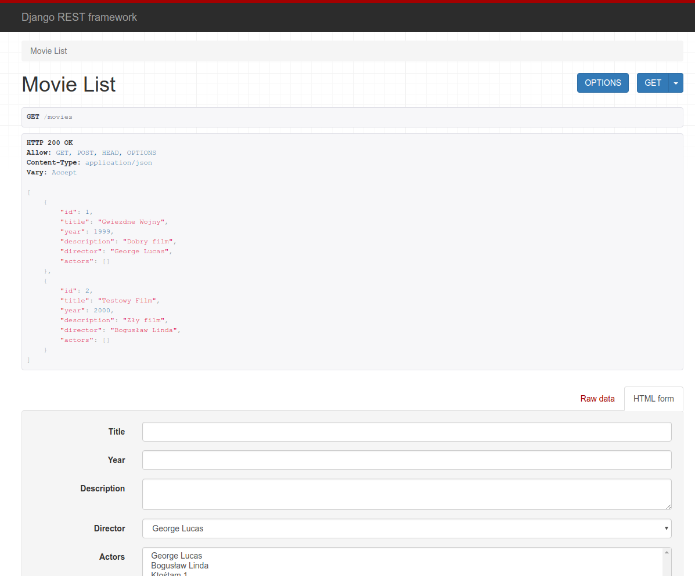
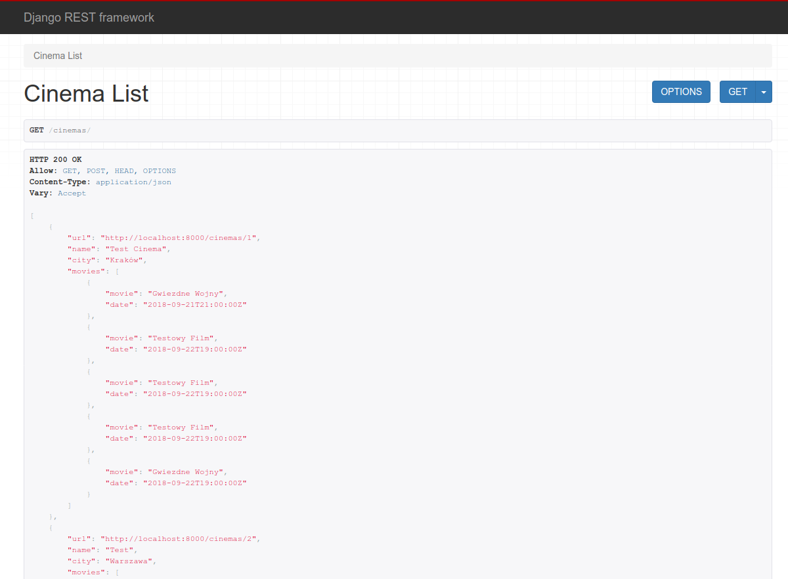
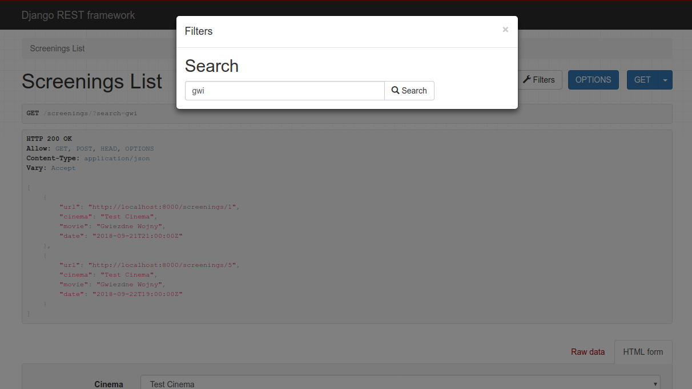
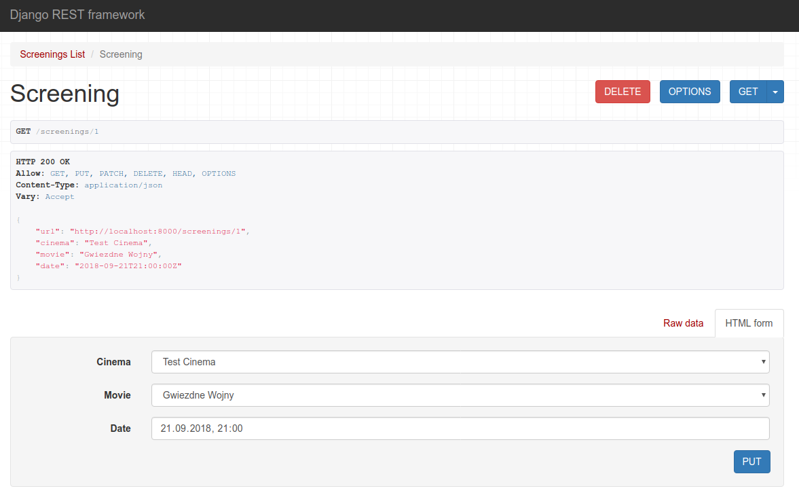

# 'MovieBase', Django REST server
A half-day bootcamp project. REST server providing data on movies and cinemas from SQL database. Built using Python and Django.

# Main features
* Browsable API
* Generic views and models for movies, cinemas, screenings
* Serializers
* API test cases for cinemas, movies, screenings - lists, adding, updates, removal
* Serializer filtering for cinemas: displaying only screenings within the next 30 days
* Search for screenings using related movies' names and cinemas' cities

# Sample screenshots

Movie list

Cinema list with screenings

Search results

Single screening

# Author
Bartosz Wójcik
bartosz.wojcik@bartvessh.com
